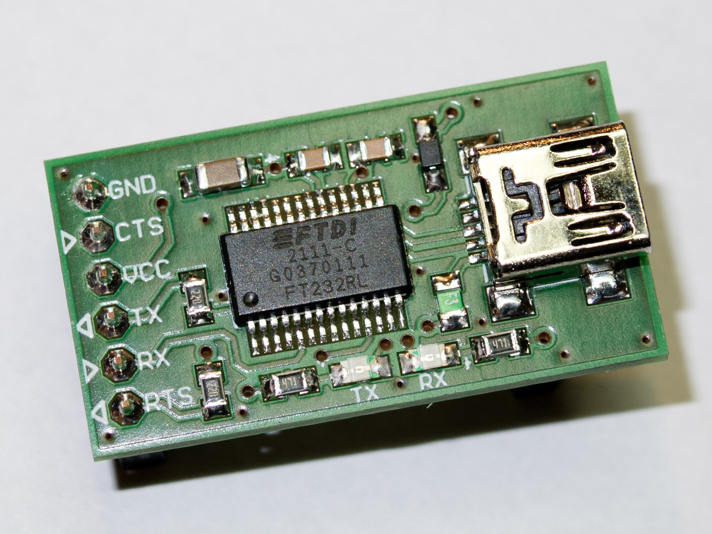

# Serial Adapter

This is a modified version of the famous [Adafruit FTDI Friend](http://www.adafruit.com/products/284), which has the advantage that you can change the signal and power lines separately to be either 3.3V or 5V.

For short circuit protection a PTC fuse (200mA, 0805 package) has been added. There is also a schottky diode (SOD-323 package) in the VCC output path, protecting the USB port from reverse current flow. (Target powered while computer switched off)

It has become a very useful tool during software development on my [DIY Moteino R6](https://lowpowerlab.com/guide/diy-moteino/). While there is also an open sourced [FTDI Adapter](https://github.com/LowPowerLab/FTDIAdapter) board, it lacks of the features mentioned above when compared to the commercial revision R3.

Parts used:
- Fuse F1: 0ZCK0020FF2G (Mouser), FSMD020-0805-R (Reichelt) or equivalent
- Schottky Diode D1: CUS10F30 (Mouser), NSR0320MW2T1G (Reichelt, Mouser) or equivalent

Links:
- [Schematic (PDF)](ftdifriendsch.pdf)
- [Circuit board (Aisler)](https://aisler.net/p/BZEBBFWU)

### License

Adafruit invests time and resources providing this open source design, please support Adafruit and open-source hardware by purchasing products from [Adafruit](https://www.adafruit.com)!

Designed by Limor Fried/Ladyada for Adafruit Industries.

Creative Commons Attribution/Share-Alike, all text above must be included in any redistribution. See license.txt for additional details.
